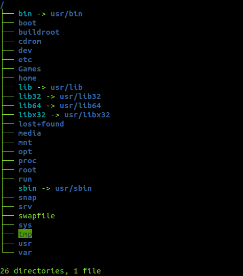

<h1>Linux Study</h1>

Repository for the study of Linux. This Markdown contains theory, practices and references.

---

<h2>Index</h2>

- [Theory](#theory)
  - [What is Linux](#what-is-linux)
    - [Popular distributions (distros)](#popular-distributions-distros)
  - [What is Unix](#what-is-unix)
  - [What is an Operating System](#what-is-an-operating-system)
  - [What is a Kernel](#what-is-a-kernel)
  - [Who is Linus Torvalds](#who-is-linus-torvalds)
  - [The GNU Project](#the-gnu-project)
  - [The Linux Foundation](#the-linux-foundation)
  - [Linux Directory Structure](#linux-directory-structure)
  - [Linux File Systems](#linux-file-systems)
- [Practice](#practice)
  - [Dependencies](#dependencies)
  - [Getting Started](#getting-started)
    - [Creating the docker container from scratch](#creating-the-docker-container-from-scratch)
    - [Create the Docker container from a Dockerfile](#create-the-docker-container-from-a-dockerfile)
    - [Configuring the container](#configuring-the-container)
  - [Understanding permissions](#understanding-permissions)
    - [Useful tool for permission calculator](#useful-tool-for-permission-calculator)
  - [Basic commands](#basic-commands)
  - [Shell Scripting](#shell-scripting)
- [References](#references)

---

# Theory

## What is Linux

Linux is a family of open-source [unix](#what-is-unix)-like [operating systems](#what-is-an-operating-system) based on the Linux [kernel](#what-is-a-kernel), developed by Linus Torvalds. [Linux distributions](#popular-distributions-distros) includes the Linux kernel and supporting system software and libraries, many of which are provided by the [GNU Project](#the-gnu-project).

### Popular distributions (distros)

<a href="https://ubuntu.com/">

</a><br>

<a href="https://www.debian.org/">

</a><br>

<a href="https://archlinux.org/">

</a><br>

<a href="https://www.kali.org/">

</a><br>

<a href="https://www.linuxmint.com/">

</a><br>

---

## What is Unix

Unix is a family of multitasking, multiuser computer [operating systems](#what-is-an-operating-system) that derive from the original AT&T Unix, whose development started at the Bell Labs research center by Ken Thompson, Dennis Ritchie, and others.

---

## What is an Operating System

An operating system (OS) is system software that manages computer hardware, software resources, and provides common services for computer programs. For hardware functions such as input and output and memory allocation, the operating system acts as an intermediary between programs and the computer hardware, although the application code is usually executed directly by the hardware and frequently makes system calls to an OS function or is interrupted by it.

---

## What is a Kernel

The kernel is a computer program at the core of a computer's operating system and has complete control over everything in the system. It is the "portion of the operating system code that is always resident in memory", and facilitates interactions between hardware and software components. A full kernel controls all hardware resources (e.g. I/O, memory, Cryptography) via device drivers, arbitrates conflicts between processes concerning such resources, and optimizes the utilization of common resources e.g. CPU & cache usage, file systems, and network sockets. On most systems, the kernel is one of the first programs loaded on startup (after the bootloader). It handles the rest of startup as well as memory, peripherals, and input/output (I/O) requests from software, translating them into data-processing instructions for the central processing unit.

---

## Who is Linus Torvalds


<p style="text-align: justify;">
Linus Benedict Torvalds is a Finnish-American software engineer who is the creator and, historically, the main developer of the Linux kernel, used by Linux distributions and other operating systems such as Android. He also created the distributed version control system Git and the scuba dive logging and planning software Subsurface.
</p>

<span style="clear: both; display: block"></span>

---

## The GNU Project


<p style="text-align: justify;">
The GNU Project is a free software, mass collaboration project that Richard Stallman announced on September 27, 1983. Its goal is to give computer users freedom and control in their use of their computers and computing devices by collaboratively developing and publishing software that gives everyone the rights to freely run the software, copy and distribute it, study it, and modify it. GNU software grants these rights in its license.
</p>

<span style="clear: both; display: block"></span>

---

## The Linux Foundation

The Linux Foundation (LF) is a non-profit technology consortium founded in 2000 to standardize Linux, support its growth, and promote its commercial adoption. It also hosts and promotes the collaborative development of open source software projects. The Linux Foundation sponsors the work of Linux creator Linus Torvalds and lead maintainer Greg Kroah-Hartman and is supported by members such as AT&T, Cisco, Facebook, Fujitsu, Google, Hitachi, Huawei, IBM, Intel, Microsoft, NEC, Oracle, Orange S.A., Qualcomm, Samsung, Tencent, and VMware, as well as developers from around the world.

In recent years, the Linux Foundation has expanded its support programs through events, training and certification, and open source projects. Projects hosted at the Linux Foundation include the Linux kernel project, Kubernetes, Automotive Grade Linux, Open Network Automation Platform (ONAP), Hyperledger, Cloud Native Computing Foundation, Cloud Foundry Foundation, Xen Project, and many others.

---

## Linux Directory Structure

The **Filesystem Hierarchy Standard (FHS)** defines the directory structure and directory contents in Linux distributions. It is maintained by the Linux Foundation. 

In the FHS, all files and directories appear under the root directory /, even if they are stored on different physical or virtual devices.

Most of these directories exist in all Unix-like operating systems and are generally used in much the same way; however, the descriptions here are those used specifically for the FHS and are not considered authoritative for platforms other than Linux.

You can see the FHC last version (3.0) [here](https://refspecs.linuxfoundation.org/FHS_3.0/fhs/index.html)

An Ubuntu filesystem hierarchy:



Linux Directory Structure:

|Directory | Description |
|----------|-------------|
| `/` | Primary hierarchy root and root directory of the entire file system hierarchy. |
| `/bin` | Essential command binaries that need to be available in single-user mode, including to bring up the system or repair it, for all users (e.g., cat, ls, cp). |
| `/boot` | Boot loader files (e.g., kernels, initrd). |
| `/dev` | Device files (e.g., /dev/null, /dev/disk0, /dev/sda1, /dev/tty, /dev/random). |
| `/etc` | Host-specific system-wide configuration files. There has been controversy over the meaning of the name itself. In early versions of the UNIX Implementation Document from Bell labs, /etc is referred to as the etcetera directory, as this directory historically held everything that did not belong elsewhere (however, the FHS restricts /etc to static configuration files and may not contain binaries). Since the publication of early documentation, the directory name has been re-explained in various ways. Recent interpretations include backronyms such as "Editable Text Configuration" or "Extended Tool Chest". |
| `/etc/opt` | Configuration files for add-on packages stored in /opt. |
| `/etc/sgml` | Configuration files, such as catalogs, for software that processes SGML. |
| `/etc/X11` | Configuration files for the X Window System, version 11. |
| `/etc/xml` | Configuration files, such as catalogs, for software that processes XML. |
| `/home` | Users' home directories, containing saved files, personal settings, etc. |
| `/lib` | Libraries essential for the binaries in /bin and /sbin. |
| `/lib<qual>` | Alternate format essential libraries. These are typically used on systems that support more than one executable code format, such as systems supporting 32-bit and 64-bit versions of an instruction set. Such directories are optional, but if they exist, they have some requirements. |
| `/media` | Mount points for removable media such as CD-ROMs (appeared in FHS-2.3 in 2004). |
| `/mnt` | Temporarily mounted filesystems. |
| `/opt` | Add-on application software packages. |
| `/proc` | Virtual filesystem providing process and kernel information as files. In Linux, corresponds to a procfs mount. Generally, automatically generated and populated by the system, on the fly. |
| `/root` | Home directory for the root user. |
| `/run` | Run-time variable data: Information about the running system since last boot, e.g., currently logged-in users and running daemons. Files under this directory must be either removed or truncated at the beginning of the boot process, but this is not necessary on systems that provide this directory as a temporary filesystem (tmpfs). |
| `/sbin` | Essential system binaries (e.g., fsck, init, route). |
| `/srv` | Site-specific data served by this system, such as data and scripts for web servers, data offered by FTP servers, and repositories for version control systems (appeared in FHS-2.3 in 2004). |
| `/sys` | Contains information about devices, drivers, and some kernel features. |
| `/tmp` | Directory for temporary files (see also /var/tmp). Often not preserved between system reboots and may be severely size-restricted. |
| `/usr` | Secondary hierarchy for read-only user data; contains the majority of (multi-)user utilities and applications. Should be shareable and read-only. |
| `/usr/bin` | Non-essential command binaries (not needed in single-user mode); for all users. |
| `/usr/include` | Standard include files. |
| `/usr/lib` | Libraries for the binaries in /usr/bin and /usr/sbin. |
| `/usr/lib<qual>` | Alternative-format libraries (e.g., /usr/lib32 for 32-bit libraries on a 64-bit machine (optional)). |
| `/usr/local` | Tertiary hierarchy for local data, specific to this host. Typically has further subdirectories (e.g., bin, lib, share).[NB 1] |
| `/usr/sbin` | Non-essential system binaries (e.g., daemons for various network services). |
| `/usr/share` | Architecture-independent (shared) data. |
| `/usr/src` | Source code (e.g., the kernel source code with its header files). |
| `/usr/X11R6 `| X Window System, Version 11, Release 6 (up to FHS-2.3, optional). |
| `/var` | Variable files: files whose content is expected to continually change during normal operation of the system, such as logs, spool files, and temporary e-mail files. |
| `/var/cache` | Application cache data. Such data are locally generated as a result of time-consuming I/O or calculation. The application must be able to regenerate or restore the data. The cached files can be deleted without loss of data. |
| `/var/lib` | State information. Persistent data modified by programs as they run (e.g., databases, packaging system metadata, etc.). |
| `/var/lock` | Lock files. Files keeping track of resources currently in use. |
| `/var/log` | Log files. Various logs. |
| `/var/mail` | Mailbox files. In some distributions, these files may be located in the deprecated /var/spool/mail. |
| `/var/opt` | Variable data from add-on packages that are stored in /opt. |
| `/var/run` | Run-time variable data. This directory contains system information data describing the system since it was booted. ||  | In FHS 3.0, /var/run is replaced by /run; a system should either continue to provide a /var/run directory or provide a symbolic link from /var/run to /run for backwards compatibility.
| `/var/spool` | Spool for tasks waiting to be processed (e.g., print queues and outgoing mail queue). |
| `/var/spool/mail` | Deprecated location for users' mailboxes. |
| `/var/tmp` | Temporary files to be preserved between reboots. |

---

## Linux File Systems

---

# Practice

## Dependencies

- [Docker](https://docs.docker.com/engine/install/)

---

## Getting Started

### Creating the docker container from scratch

If you don't want to create the docker container from scratch see the [next topic](#create-the-docker-container-from-a-dockerfile). But if you want to create the container from scratch, continue reading.

Pull the docker image for Debian 11:

```shell
$ docker pull debian:bullseye
```

Create and run the container:

```shell
$ docker run -d -it --name linux-study-container debian:bullseye
```

Check if the container was created, and get its id:

```shell
$ docker ps
```

Copy the scripts directory to the container:

```shell
$ docker cp scripts <container_id>:/home/scripts
```

Get into the container with:

```shell
$ docker exec -it linux-study-container /bin/bash
```

From inside of the container, update and install the procps* and some basic commands

```shell
$ apt update && apt install -y procps less tree man sudo vim
```

***procps**: command-line and full-screen utilities for navigating procfs &ndash; a "pseudo"-filesystem dynamically generated by the kernel to give information about the status of entries in your process table

### Create the Docker container from a Dockerfile

Create the image from the Dockerfile:

```shell
$ docker build -t linux-study-img .
```

Check the created image:

```shell
$ docker image ls
```

Run a container from that image:

```shell
$ docker run -d -it --name linux-study-container linux-study-img
```

### Configuring the container

Get into the container with:

```shell
$ docker exec -it linux-study-container bash
```

Create an user:

```shell
$ adduser <username>
```

Add the user to the sudo group:

```shell
$ usermod -aG sudo <username>
```

Show all users:

```shell
$ less /etc/passwd
```

Change user to the created user:

```shell
$ su <username>
```

Or:

```shell
$ sudo -u <username> -s
```

*In order to get back into root user, just hit `CTRL + D` or type `$ exit`.

## Understanding permissions

### Useful tool for permission calculator

[chmod Calculator](https://chmod-calculator.com/)

---

## Basic commands

[Complete Reference](linux-commands-cheat-sheet-by-pnap.pdf)

**ls**

**whoami**

**cd**

**mkdir**

**rm**

**ln**

**pwd**

**touch**

**echo**

**tail**

**chmod**

**groupadd**

---

## Shell Scripting

---

# References

[1] [Miguel Nischor](https://github.com/mgnischor)

[2] [Debian](https://www.debian.org/)

[3] [Docker documentation](https://docs.docker.com/)

[4] [Wikipedia](https://en.wikipedia.org/)
